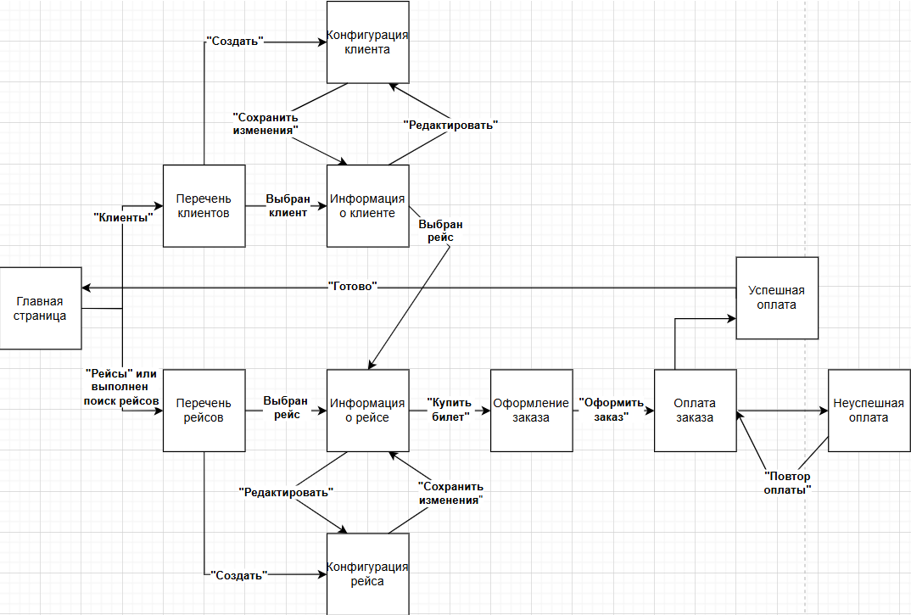
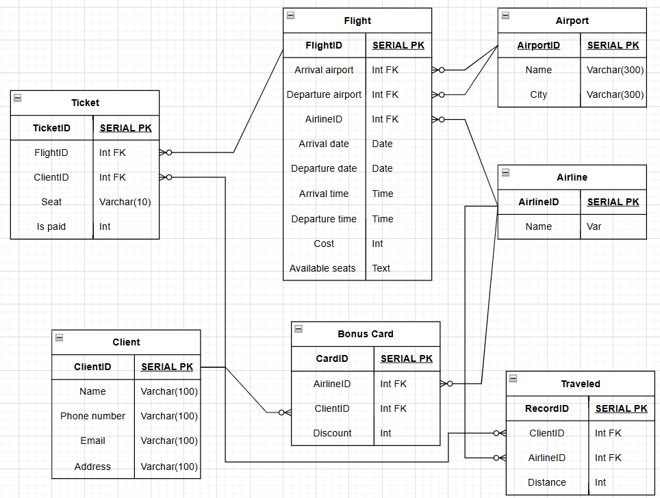

# Авиаперевозки #
***
Проект выполнен студентом 328 группы Обуховым Георгием.
## Страницы сайта ##

Помимо указанных переходов между страницами, на каждой в шапке находятся главная страница и перечни клиентов и рейсов.
1. ### Главная страница 
    * Приветственная информацию, описание сервиса.
    * Поиск рейсов по направлению и/или дате.
2. ### Перечень клиентов
    * Список клиентов с возможностью фильтрации по ФИО, рейсу или телефону.
    * Кнопка "Создать" для создания нового клиента.
    * При нажатии на ФИО клиента осуществляется переход на страницу с информацией о нем.
    * Кнопка "Удалить" для удаления соответствующего клиента.
3. ### Информация о клиенте
    * ФИО, контактная информация, бонусные карты, рейсы клиента.
    * При выборе рейса происходит переход на "Информацию о рейсе".
    * Кнопка "Редактировать" для редактирования информации о клиенте.
    * Кнопка "Удалить". При удалении переход происходит на "Перечень клиентов".
    * Информация о налетанных километрах для каждой авиакомпании.
4. ### Конфигурация клиента
   * Формы для ФИО и контактной информации
   * Формы для добавления бонусных карт клиента (есть кнопки "Добавить" и "Удалить").
5. ### Перечень рейсов
   * Список рейсов с возможностью фильтрации по дате, направлению, авиакомпании, количества свободных мест, диапазон стоимости.
   * Поиск по номеру рейса.
   * Рейс содержит номер рейса, дата, время, город и аэропорт вылета и прилета.
   * При нажатии на строку с рейсом переход на "Информация о рейсе".
   * Кнопка "Создать" для создания нового рейса.
   * Кнопка "Удалить" для удаления соответствующего рейса.
6. ### Информация о рейсе
   * Информация о дате, времени, городе и аэропорте вылета и прилета, номер рейса, авиакомпании-перевозчика, стоимость билетов, наличие мест.
   * Кнопка "Удалить". При удалении переход происходит на "Перечень рейсов".
   * Кнопка "Редактировать" для редактирования информации о рейсе.
   * Кнопка "Купить билет" для оформления билетов на этот рейс, если есть места.
7. ### Конфигурация рейса
   * Формы для информации о рейсе.
   * Кнопка "Сохранить изменения". 
8. ### Оформление заказа
   * Краткая информация о полете (номер рейса, дата, начальный и конечный аэропорт).
   * Выбор места на самолете. 
   * Форма для ввода данных о клиенте (ФИО, номер телефона).
   * Кнопка "Оформить заказ" для перехода на страницу для оплаты.
9. ### Оплата заказа
   * Краткая информация о полете.
   * Возможность использования бонусных карт (выбор из выпадающего списка).
   * Кнопка "Оплатить".
10. ### Успешная оплата
      * Уведомление об успешной оплате, выдача номера заказа.
11. ### Неуспешная оплата
      * Уведомление о невыполненной оплате, предложение перейти на страницу для повторной оплаты.
   
## Сценарии использования
1. #### Получение списка авиарейсов по датам и направлениям, информации о ценах билетов и наличии свободных мест
   * Главная страница --(Рейсы)--> Перечень рейсов. Сортируем по желаемым признакам.
2. #### Получение списка клиентов, в т.ч. летавших определенным рейсом, любыми рейсами авиакомпании, заказавших и оплативших билеты
   * Главная страница --(Клиенты)--> Перечень клиентов. Сортируем по желаемым признакам.
3. #### Получение истории заказов клиента, информации о его бонусах и их использовании
   * Главная страница --(Клиенты)--> Перечень клиентов --(Выбран клиент)--> Информация о клиенте. Берем необходимую информацию.
4. #### Заказ и оплата билетов на выбранный рейс
   * Главная страница --(Рейсы)--> Перечень рейсов --(Выбран рейс)--> Информация о рейсе --(Купить билет)--> Оформление заказа --(Оформить заказ)--> Оплата заказа --(Оплатить)--> Успешная оплата.
5. #### Добавление и удаление рейса/клиента, чтение и редактирование данных о нем
   * Главная страница --(Рейсы/Клиенты)--> Перечень рейсов/клиентов --(Выбран рейс/клиент)--> Информация о рейсе/клиенте --(Редактировать)--> Конфигурация рейса/клиента. Редактируем. 

   ИЛИ
   * Главная страница --(Рейсы/Клиенты)--> Перечень рейсов/клиентов --(добавить рейс/клиента)--> Конфигурация рейса/клиента. Создаем новый объект.

## Схема базы данных

### Пояснения:
   * Поле Available seats таблицы Flight содержит через запятую номера свободных мест. Пример: "1A,13D".
   * Таблица Traveled показывает, сколько клиент налетал для каждого авиаперевозчика. Нет записей, где Distance=0.
   * В таблице Ticket "Is paid" показывает, забронирован билет или куплен (0 - забронирован, 1 - куплен. Других вариантов быть не может).